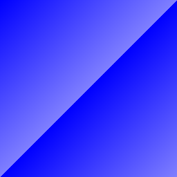

## Packages

This program is using the packages with import paths `"fmt"` and `"math/rand"`.

**Note:** The environment in which these programs are executed is deterministic, so each time you run the example program `rand.Intn` will return the same number.

(To see a different number, seed the number generator; see [`rand.Seed`](https://golang.org/pkg/math/rand/#Seed). Time is constant in the playground, so you will need to use something else as the seed.)

## Imports

This code groups the imports into a parenthesized, "factored" import statement.

```go
import (
	"fmt"
	"math"
)
```

## Exported names	

In Go, a name is exported if it begins with a capital letter.

## Functions

A function can take zero or more arguments.

(For more about why types look the way they do, see the [article on Go's declaration syntax](https://blog.golang.org/gos-declaration-syntax).)

## Functions continued

When two or more consecutive named function parameters share a type, you can omit the type from all but the last.

In this example, we shortened

```go
x int, y int
```

to

```go
x, y int
```

```go
package main

import "fmt"
func add(x, y int) int {
	return x + y
}

func main() {
	fmt.Println(add(4,9))
}
```

## Multiple results

A function can return any number of results. 

```go
package main

import "fmt"

func swap(x, y string) (string, string) {
	return y, x
}

func main()  {
	//fmt.Println(swap("hello", "world"))
	a,b := swap("Hello", "World")
	fmt.Println(a, b)
}
```

## Named return values

Go's return values may be named. If so, they are treated as variables defined at the top of the function.

These names should be used to document the meaning of the return values.

A `return` statement without arguments returns the named return values. This is known as a "naked" return.

Naked return statements should be used only in short functions, as with the example shown here. They can harm readability in longer functions.

```go
package main

import "fmt"
func split(sum int) (x, y int) {
	x = sum * 5 / 10
	y = sum - x
	return
}

func main() {
	fmt.Println(split(30))
}
```

## Variables

The `var` statement declares a list of variables; as in function argument lists, the type is last.

A `var` statement can be at package or function level. We see both in this example.

```go
package main

import (
	"fmt"
)

var Google, Apple ,Amazon bool
func main()  {
	var i int
	fmt.Println(i,Google, Apple, Amazon)
}
```

## Variables with initializers

A var declaration can include initializers, one per variable.

If an initializer is present, the type can be omitted; the variable will take the type of the initializer.

```go
package main

import "fmt"

var i, j int = 3, 4

func main() {
	var python, c, java  = true, false ,"yes"
	fmt.Println(i,j,python,c,java)
}
```

Output:

```go
3 4 true false yes
```

## Short variable declarations		

Inside a function, the `:=` short assignment statement can be used in place of a `var` declaration with implicit type.

Outside a function, every statement begins with a keyword (`var`, `func`, and so on) and so the `:=` construct is not available.

```go
package main

import "fmt"

func main() {
	var i, j int = 3, 4
	c, python, cplusplus := "c", "python", "cplusplus"
	fmt.Println(i, j, c, python, cplusplus)
}
```

Output:

```go
3 4 c python cplusplus
```

## Basic types

Go's basic types are

```go
bool

string

int  int8  int16  int32  int64
uint uint8 uint16 uint32 uint64 uintptr

byte // alias for uint8

rune // alias for int32
     // represents a Unicode code point

float32 float64

complex64 complex128
```

The example shows variables of several types, and also that variable declarations may be "factored" into blocks, as with import statements.

The `int`, `uint`, and `uintptr` types are usually 32 bits wide on 32-bit systems and 64 bits wide on 64-bit systems. When you need an integer value you should use `int` unless you have a specific reason to use a sized or unsigned integer type.

```go
package main

import (
	"fmt"
	"math/cmplx"
)
var	(
	Tobe bool = false
	MaxInt uint64 = 1 << 64-1
	z  complex128 = cmplx.Sqrt(-5 + 12i)
)
func main() {
	fmt.Printf("Type: %T Value: %v\n",Tobe, Tobe)
	fmt.Printf("Type: %T Value: %v\n",MaxInt, MaxInt)
	fmt.Printf("Type: %T Value: %v\n",z, z)
}
```

Output :

```go
Type: bool Value: false
Type: uint64 Value: 18446744073709551615
Type: complex128 Value: (2+3i)
```

## Zero values

Variables declared without an explicit initial value are given their *zero value*.

The zero value is:

`0` for numeric types,

`false` for the boolean type, and

`""` (the empty string) for strings.

```go
package main

import "fmt"

func main() {
	var i int
	var f float64
	var mj bool
	var google string
	fmt.Printf("%v %v %v %q",i, f, mj, google)
}
```

Output :

```
0 0 false ""
```

## Type conversions

The expression `T(v)` converts the value `v` to the type `T`.

Some numeric conversions:

```
var i int = 42
var f float64 = float64(i)
var u uint = uint(f)
```

Or, put more simply:

```
i := 42
f := float64(i)
u := uint(f)
```

Unlike in C, in Go assignment between items of different type requires an explicit conversion. Try removing the `float64` or `uint` conversions in the example and see what happens.

```go
package main

import (
   "fmt"
   "math"
)

func main() {
   var x, y int = 6, 9
   var f float64 = math.Sqrt(float64(x*x + y*y))
   var u uint = uint(f)
   fmt.Println(x, y, f, u)
}
```

Output :

```
6 9 10.816653826391969 10
```

## Type inference

When declaring a variable without specifying an explicit type (either by using the `:=` syntax or `var =` expression syntax), the variable's type is inferred from the value on the right hand side.

When the right hand side of the declaration is typed, the new variable is of that same type:

```
var i int
j := i // j is an int
```

But when the right hand side contains an untyped numeric constant, the new variable may be an `int`, `float64`, or `complex128` depending on the precision of the constant:

```
i := 42           // int
f := 3.142        // float64
g := 0.867 + 0.5i // complex128
```

Try changing the initial value of `v` in the example code and observe how its type is affected.

```go
package main

import "fmt"

func main() {
   v := 42
   fmt.Printf("v is of type %T, value is of %v\n",v,v)
   f := 42.00
   fmt.Printf("f is of type %T, value is of %f\n",f,f)
}
```

Output :

```
v is of type int, value is of 42
f is of type float64, value is of 42.000000
```

## Constants

Constants are declared like variables, but with the `const` keyword.

Constants can be character, string, boolean, or numeric values.

Constants cannot be declared using the `:=` syntax.

```go
package main

import "fmt"

const Pi = 3.14
func main() {
   const Word = "Google"
   fmt.Println("Hello",Word)
   fmt.Println("Happy", Pi, "Day")
}
```

Output :

```
Hello Google
Happy 3.14 Day
```

## Numeric Constants

Numeric constants are high-precision *values*.

An untyped constant takes the type needed by its context.

Try printing `needInt(Big)` too.

(An `int` can store at maximum a 64-bit integer, and sometimes less.)

```go
package main

import "fmt"

const(
   // Create a huger number by shifting a 1 bit left 100 places
   // In other words, the binary number is 1 followed by 100 zeros.
   Big = 1 << 100
   // Shift it right again 99 places, so we end with 1 << 1 or 2.
   Small = Big >> 99
)

func needInt(x int) int { return 10*x + 1}
func needFloat(x float64) float64 { return x*0.1}
func main() {
   fmt.Println(needInt(Small))
   fmt.Println(needFloat(Small))
   //fmt.Println(needInt(Big))  //overflows int
   fmt.Println(needFloat(Big))
}
```

Output :

```
21
0.2
1.2676506002282295e+29
```

## For

Go has only one looping construct, the `for` loop.

The basic `for` loop has three components separated by semicolons:

​		the init statement: executed before the first iteration

​		the condition expression: evaluated before every iteration

​		the post statement: executed at the end of every iteration

The init statement will often be a short variable declaration, and the variables declared there are visible only in the scope of the `for` statement.

The loop will stop iterating once the boolean condition evaluates to `false`.

**Note:** Unlike other languages like C, Java, or JavaScript there are no parentheses surrounding the three components of the `for` statement and the braces `{ }` are always required.

```go
package main

import "fmt"

func main() {
   sum := 0
   for i := 1; i <= 100; i++ {
      sum += i
   }
   fmt.Printf("Total is %v", sum)
}
```

Output :

```
Total is 5050
```

## For continued

The init and post statements are optional.

```go
package main

import "fmt"

func main() {
   sum := 1
   for ;sum < 1000;  {
      sum += sum
      //fmt.Println(sum)
   }
   fmt.Println(sum)
}
```

Output :

```
1024
```

## For is Go's "while"

At that point you can drop the semicolons: C's `while` is spelled `for` in Go.

```go
package main

import "fmt"

func main() {
   sum := 1
   for sum < 1000 {
      sum += sum
   }
   fmt.Println(sum)
}
```

Output ：

```
1024
```

## Forever

If you omit the loop condition it loops forever, so an infinite loop is compactly expressed.

```go
package main

import "fmt"

func main() {
   i := 0
   for{
      i++
      fmt.Println("I love mj",i)
   }
}
```

Output :

```
...
I love mj 616161
I love mj 616162
I love mj 616163
I love mj 61
```

## If

Go's `if` statements are like its `for` loops; the expression need not be surrounded by parentheses `( )` but the braces `{ }` are required.

```go
package main

import (
   "fmt"
   "math"
)

func sqrt(x float64) string {
   if x < 0 {
      return sqrt(-x) + "i"
   }
   return  fmt.Sprint(math.Sqrt(x))
}

func main() {
   fmt.Println(sqrt(520),sqrt(-520))
}
```

Output :

```
22.80350850198276 22.80350850198276i
```

## If with a short statement

Like `for`, the `if` statement can start with a short statement to execute before the condition.

Variables declared by the statement are only in scope until the end of the `if`.

(Try using `v` in the last `return` statement.)

```go
package main

import (
   "fmt"
   "math"
)

func pow(x, n, lim float64) float64 {
   if v:= math.Pow(x,n); v < lim{
      return v
   }
   return lim
}

func main() {
   fmt.Println(
      pow(2,8,520),
      pow(3,6,520),
      )
}
```

Output :

```
256 520
```

## If and else

Variables declared inside an `if` short statement are also available inside any of the `else` blocks.

(Both calls to `pow` return their results before the call to `fmt.Println` in `main` begins.)

```go
package main

import (
   "fmt"
   "math"
)

func pow(x , n , lim float64) float64  {
   if v:= math.Pow(x,n); v < lim{
      return v
   }else{
      fmt.Printf("%g >= %g\n",v,lim)
   }
   return lim
}

func main() {
   fmt.Println(
      pow(2,6,40),
      pow(2,5,520),
      )
}
```

Output :

```
64 >= 40
40 32
```

## Exercise: Loops and Functions

As a way to play with functions and loops, let's implement a square root function: given a number x, we want to find the number z for which z² is most nearly x.

Computers typically compute the square root of x using a loop. Starting with some guess z, we can adjust z based on how close z² is to x, producing a better guess:

```
z -= (z*z - x) / (2*z)
```

Repeating this adjustment makes the guess better and better until we reach an answer that is as close to the actual square root as can be.

Implement this in the `func Sqrt` provided. A decent starting guess for z is 1, no matter what the input. To begin with, repeat the calculation 10 times and print each z along the way. See how close you get to the answer for various values of x (1, 2, 3, ...) and how quickly the guess improves.

Hint: To declare and initialize a floating point value, give it floating point syntax or use a conversion:

```
z := 1.0
z := float64(1)
```

Next, change the loop condition to stop once the value has stopped changing (or only changes by a very small amount). See if that's more or fewer than 10 iterations. Try other initial guesses for z, like x, or x/2. How close are your function's results to the [math.Sqrt](https://golang.org/pkg/math/#Sqrt) in the standard library?

(**Note:** If you are interested in the details of the algorithm, the z² − x above is how far away z² is from where it needs to be (x), and the division by 2z is the derivative of z², to scale how much we adjust z by how quickly z² is changing. This general approach is called [Newton's method](https://en.wikipedia.org/wiki/Newton's_method). It works well for many functions but especially well for square root.)

```go
package main

import (
   "fmt"
   "math"
)

func Sqrt(x float64) float64 {
   z := float64(1)
   for i:= 1; i <= 10; i++{
      z -= (z*z - x) / (2*z)
   }
   return z
}

func main() {
   p :=2.0
   fmt.Println(Sqrt(p))
   fmt.Println(math.Sqrt(p))
}
```

Output :

```
1.414213562373095
1.4142135623730951
```

## Switch

A `switch` statement is a shorter way to write a sequence of `if - else` statements. It runs the first case whose value is equal to the condition expression.

Go's switch is like the one in C, C++, Java, JavaScript, and PHP, except that Go only runs the selected case, not all the cases that follow. In effect, the `break` statement that is needed at the end of each case in those languages is provided automatically in Go. Another important difference is that Go's switch cases need not be constants, and the values involved need not be integers.

```go
package main

import (
   "fmt"
   "runtime"
)

func main() {
   fmt.Print("Go runs on ")
   switch os := runtime.GOOS; os{
   case "darwin":
      fmt.Println("OS X")
   case "linux":
      fmt.Println("Linux")
   case "windows":
      fmt.Println("windows")
   default:
      fmt.Printf("%s.\n",os)
   }
}
```

## Switch evaluation order

Switch cases evaluate cases from top to bottom, stopping when a case succeeds.

(For example,

```
switch i {
case 0:
case f():
}
```

does not call `f` if `i==0`.)

**Note:** Time in the Go playground always appears to start at 2009-11-10 23:00:00 UTC, a value whose significance is left as an exercise for the reader.

```go
package main

import (
   "fmt"
   "time"
)

func main()  {
   fmt.Println("When's Saturday")
   today := time.Now().Weekday()
   fmt.Println(today)
   switch time.Saturday{
   case today + 0:
      fmt.Println("Today.")
   case today + 1:
      fmt.Println("Tomorrow.")
   case today + 3:
      fmt.Println("In three days.")
   default:
      fmt.Println("Too far away.")
   }
}
```

Output :

```
When's Saturday
Wednesday
In three days.
```

## Switch with no condition

Switch without a condition is the same as `switch true`.

This construct can be a clean way to write long if-then-else chains.

```go
package main

import (
   "fmt"
   "time"
)

func main() {
   t := time.Now()
   fmt.Println(t)
   fmt.Println(t.Hour(),t.Minute(),t.Second())
   switch {
   case t.Hour() < 12:
      fmt.Println("Good morning!")
   case t.Hour() < 17:
      fmt.Println("Good afternoon!")
   default:
      fmt.Println("Good evening!")
   }
}
```

Output :

```
2020-03-04 21:12:06.503189 +0800 CST m=+0.000079829
21 12 6
Good evening!
```

## Defer

A defer statement defers the execution of a function until the surrounding function returns.

The deferred call's arguments are evaluated immediately, but the function call is not executed until the surrounding function returns.

```go
package main

import "fmt"

func main() {
   defer fmt.Println("world")
   fmt.Println("hello")
}
```

Output :

```
hello
world
```

## Stacking defers

Deferred function calls are pushed onto a stack. When a function returns, its deferred calls are executed in last-in-first-out order.

To learn more about defer statements read this [blog post](https://blog.golang.org/defer-panic-and-recover).

[Defer, Panic, and Recover](https://blog.golang.org/defer-panic-and-recover)

```go
package main

import "fmt"

func main() {
   fmt.Println("counting")

   for i := 1; i <= 5; i++{
      defer fmt.Println(i)
   }
   fmt.Println("done")
}
```

Output :

```
counting
done
5
4
3
2
1
```

## Congratulations!

You finished this lesson!

You can go back to the list of [modules](https://tour.golang.org/list) to find what to learn next, or continue with the [next lesson](javascript:click('.next-page'))

## Pointers

Go has pointers. A pointer holds the memory address of a value.

The type `*T` is a pointer to a `T` value. Its zero value is `nil`.

```
var p *int
```

The `&` operator generates a pointer to its operand.

```
i := 42
p = &i
```

The `*` operator denotes the pointer's underlying value.

```
fmt.Println(*p) // read i through the pointer p
*p = 21         // set i through the pointer p
```

This is known as "dereferencing" or "indirecting".

Unlike C, Go has no pointer arithmetic.

```go
package main

import "fmt"

func main() {
   i, j := 4, 5

   p := &i          // point to i
   fmt.Println(*p) // read i through the pointer
   *p = 32       // set i through the pointer
   fmt.Println("the new value of i ",i)  // see the new value of i

   p = &j        // point to j
   *p = *p / 23   // divide j through the pointer
   fmt.Println("the new value of j ", j)  // see the new value of j

}
```

Output :

```
4
the new value of i  32
the new value of j  0
```

## Structs

A `struct` is a collection of fields.

```go
package main

import "fmt"

type Vertex struct{
   X int
   Y int
}

func main() {
   fmt.Println(Vertex{1,520,})
}
```

Output :

```
{1 520}
```

## Struct Fields

Struct fields are accessed using a dot.

```go
package main

import "fmt"

type Vertex struct{
   X int
   Y int
}

func main() {
   v := Vertex{1,4}
   fmt.Println(v)
   v.X = 5
   v.Y = 0
   fmt.Println(v)
}
```

Output :

```
{1 4}
{5 0}
```

## Pointers to structs

Struct fields can be accessed through a struct pointer.

To access the field `X` of a struct when we have the struct pointer `p` we could write `(*p).X`. However, that notation is cumbersome, so the language permits us instead to write just `p.X`, without the explicit dereference.

```go 
package main

import "fmt"

type Vertex struct {
   X int
   Y int
}

func main() {
   v := Vertex{1,10}
   fmt.Println(v)
   p := &v
   (*p).X = 10
   p.Y = 100
   fmt.Println(v)
}
```

Output :

```
{1 10}
{10 100}
```

## Struct Literals

A struct literal denotes a newly allocated struct value by listing the values of its fields.

You can list just a subset of fields by using the `Name:` syntax. (And the order of named fields is irrelevant.)

The special prefix `&` returns a pointer to the struct value.

```go
package main

import "fmt"

type Vertex struct{
	X, Y int
}

var(

	v1 = Vertex{X:1}		// Y:0 is implicit
	v2 = Vertex{}			// X:0 and Y:0
	p = &Vertex{1,3}	// has type *Vertex
)

func main() {
	v := Vertex{1,2}	// has type Vertex
	fmt.Println(v, v1, v2, p, *p)
}
```

Output :

```
{1 2} {1 0} {0 0} &{1 3} {1 3}
```

## Arrays

The type `[n]T` is an array of `n` values of type `T`.

The expression

```
var a [10]int
```

declares a variable `a` as an array of ten integers.

An array's length is part of its type, so arrays cannot be resized. This seems limiting, but don't worry; Go provides a convenient way of working with arrays.

```go
package main

import "fmt"

func main() {
   var str [2]string
   str[0] = "Hello"
   str[1] = "World"
   fmt.Println(str[0],str[1])
   fmt.Println(str)

   primes := [6]int{2,3,5,7,11,13}
   fmt.Println(primes)
}
```

Output :

```
Hello World
[Hello World]
[2 3 5 7 11 13]
```

## Slices

An array has a fixed size. A slice, on the other hand, is a dynamically-sized, flexible view into the elements of an array. In practice, slices are much more common than arrays.

The type `[]T` is a slice with elements of type `T`.

A slice is formed by specifying two indices, a low and high bound, separated by a colon:

```
a[low : high]
```

This selects a half-open range which includes the first element, but excludes the last one.

The following expression creates a slice which includes elements 1 through 3 of `a`:

```
a[1:4]
```

```go 
package main

import "fmt"

func main() {
	primes := [6]int{2, 3, 5, 7, 11, 13}
	var s []int = primes[1:4]
	fmt.Println(s)
}
```

Output :

```
[3 5 7]
```

## Slices are like references to arrays

A slice does not store any data, it just describes a section of an underlying array.

Changing the elements of a slice modifies the corresponding elements of its underlying array.

Other slices that share the same underlying array will see those changes.

```go
package main

import "fmt"

func main(){
   names := [4]string {
      "mj",
      "henry",
      "lbq",
      "jy",
   }

   fmt.Println(names)
   a := names[0:1]
   fmt.Println(a)
   b := names[1:4]
   fmt.Println(b)
   b[0] = "henry20"
   fmt.Println(b)
   fmt.Println(names)
}
```

Output :

```
[mj henry lbq jy]
[mj]
[henry lbq jy]
[henry20 lbq jy]
[mj henry20 lbq jy]
```

## Slice literals

A slice literal is like an array literal without the length.

This is an array literal:

```
[3]bool{true, true, false}
```

And this creates the same array as above, then builds a slice that references it:

```
[]bool{true, true, false}
```

```go
package main

import "fmt"

func main() {
   q := []int{3, 7, 9, 11, 13}
   fmt.Println(q)

   r := []bool{false, true, false, true}
   fmt.Println(r)

   s := []struct{
      x int
      b bool
   }{
      {1, false},
      {2, false},
      {520, true},
   }
   fmt.Println(s)
}
```

Output :

```
[3 7 9 11 13]
[false true false true]
[{1 false} {2 false} {520 true}]
```

## Slice defaults

When slicing, you may omit the high or low bounds to use their defaults instead.

The default is zero for the low bound and the length of the slice for the high bound.

For the array

```
var a [10]int
```

these slice expressions are equivalent:

```
a[0:10]
a[:10]
a[0:]
a[:]
```

```go
package main

import "fmt"

func main() {
   s := []int{2, 3, 520 ,11, 13}

   s = s[1:4]
   fmt.Println(s)

   s = s[:2]
   fmt.Println(s)

   s = s[1:]
   fmt.Println(s)
}
```

Output :

```
[3 520 11]
[3 520]
[520]
```

## Slice length and capacity

A slice has both a *length* and a *capacity*.

The length of a slice is the number of elements it contains.

The capacity of a slice is the number of elements in the underlying array, counting from the first element in the slice.

The length and capacity of a slice `s` can be obtained using the expressions `len(s)` and `cap(s)`.

You can extend a slice's length by re-slicing it, provided it has sufficient capacity. Try changing one of the slice operations in the example program to extend it beyond its capacity and see what happens.

```go
package main
import "fmt"

func main() {
   s := []int{2, 3, 5, 7, 11, 13, 520}
   printSlice(s)

   // Slice the slice to give it zero length.
   s = s[:0]
   printSlice(s)

   // Extend its length.
   s = s[:4]
   printSlice(s)

   // Drop its first two values.
   s = s[2:]
   printSlice(s)
}

func printSlice(s []int) {
   fmt.Printf("len=%d cap=%d %v\n",len(s),cap(s),s)
}
```

Output :

```
len=7 cap=7 [2 3 5 7 11 13 520]
len=0 cap=7 []
len=4 cap=7 [2 3 5 7]
len=2 cap=5 [5 7]
```

## Nil slices

The zero value of a slice is `nil`.

A nil slice has a length and capacity of 0 and has no underlying array.

```go
package main

import "fmt"

func main() {
   var s[] int
   if len(s) == 0{
      fmt.Println("0")
   }

   fmt.Println(s,len(s),cap(s))

   if s == nil{
      fmt.Println("nil!")
   }
   // panic: runtime error: index out of range [0] with length 0
   s[0] = 3
   fmt.Println(s)
}
```

Output :

```
0
[] 0 0
nil!
panic: runtime error: index out of range [0] with length 0

goroutine 1 [running]:
main.main()
```

## Creating a slice with make

Slices can be created with the built-in `make` function; this is how you create dynamically-sized arrays.

The `make` function allocates a zeroed array and returns a slice that refers to that array:

```
a := make([]int, 5)  // len(a)=5
```

To specify a capacity, pass a third argument to `make`:

```
b := make([]int, 0, 5) // len(b)=0, cap(b)=5

b = b[:cap(b)] // len(b)=5, cap(b)=5
b = b[1:]      // len(b)=4, cap(b)=4
```

```go
package main

import "fmt"

func main() {
   a := make([]int,5)
   println("a",a)
   printSlice("a",a)

   b := make([]int, 0,5)
   printSlice("b", b)

   c := b[:2]
   printSlice("c", c)

   d := c[2:5]
   printSlice("d",d)
}

func printSlice(s string,x []int) {
   fmt.Printf("%s len=%d cap=%d %v\n",
      s, len(x), cap(x), x)
}
```

Output :

```
a [5/5]0xc000114030
a len=5 cap=5 [0 0 0 0 0]
b len=0 cap=5 []
c len=2 cap=5 [0 0]
d len=3 cap=3 [0 0 0]
```

## Slices of slices

Slices can contain any type, including other slices.

```go
package main

import (
   "fmt"
   "strings"
)

func main() {
   // creat a tic-tac-toe board.
   board := [][]string{
      []string{"_", "_", "_"},
      []string{"_", "_", "_"},
      []string{"^", "_", "^"},
   }
   // The player takes turns.
   board[0][0] = "x"
   board[2][1] = "o"
   board[1][2] = "o"
   board[1][0] = "o"
   board[0][2] = "x"

   for i:=0; i < len(board); i++{
      fmt.Printf("%s\n", strings.Join(board[i]," "))
   }
}
```

Output :

```
x _ x
o _ o
^ o ^
```

## Appending to a slice

It is common to append new elements to a slice, and so Go provides a built-in `append` function. The [documentation](https://golang.org/pkg/builtin/#append) of the built-in package describes `append`.

```
func append(s []T, vs ...T) []T
```

The first parameter `s` of `append` is a slice of type `T`, and the rest are `T` values to append to the slice.

The resulting value of `append` is a slice containing all the elements of the original slice plus the provided values.

If the backing array of `s` is too small to fit all the given values a bigger array will be allocated. The returned slice will point to the newly allocated array.

(To learn more about slices, read the [Slices: usage and internals](https://blog.golang.org/go-slices-usage-and-internals) article.)

```go
package main

import "fmt"

func main() {
   var s[]int
   printSlices(s)

   // append works on nil slices
   s = append(s, 0)
   printSlices(s)

   // the slices grows as need
   s = append(s, 1)
   printSlices(s)

   // we can add more elements at a time
   s = append(s, 520,1,1314)
   printSlices(s)
}

func printSlices(s []int) {
   fmt.Printf("len=%d cap=%d %v\n",len(s), cap(s), s)
}
```

Output :

```
len=0 cap=0 []
len=1 cap=1 [0]
len=2 cap=2 [0 1]
len=5 cap=6 [0 1 520 1 1314]
```

## Range

The `range` form of the `for` loop iterates over a slice or map.

When ranging over a slice, two values are returned for each iteration. The first is the index, and the second is a copy of the element at that index.

```go
package main

import "fmt"

var pow = []int{1, 2, 4, 8, 16, 32, 64}
func main() {
   for i , v := range pow{
      fmt.Printf("2**%d = %d\n",i ,v)
   }
}
```

Output :

```
2**0 = 1
2**1 = 2
2**2 = 4
2**3 = 8
2**4 = 16
2**5 = 32
2**6 = 64
```

## Range continued

You can skip the index or value by assigning to `_`.

```
for i, _ := range pow
for _, value := range pow
```

If you only want the index, you can omit the second variable.

```
for i := range pow
```

```go
package main

import "fmt"

func main() {
   pow := make([]int, 10)
   fmt.Println(pow)
   // index
   for i := range pow{
      pow[i] = 1 << uint(i) // == 2**i
   }
   // value
   for _, value := range pow{
      fmt.Printf("%d\n", value)
   }
}
```

Output :

```
[0 0 0 0 0 0 0 0 0 0]
1
2
4
8
16
32
64
128
256
512
```

## Exercise: Slices

Implement `Pic`. It should return a slice of length `dy`, each element of which is a slice of `dx` 8-bit unsigned integers. When you run the program, it will display your picture, interpreting the integers as grayscale (well, bluescale) values.

The choice of image is up to you. Interesting functions include `(x+y)/2`, `x*y`, and `x^y`.

(You need to use a loop to allocate each `[]uint8` inside the `[][]uint8`.)

(Use `uint8(intValue)` to convert between types.)

```go
package main

import "code.google.com/p/go-tour/pic"

func Pic(dx, dy int) [][]uint8 {
   a := make([][]uint8, dy)
   for i := range(a){
      a[i] = make([]uint8,dx)
   }

   for i := range(a){
      for j:= range(a[i]){
         a[i][j] = uint8(i+j) /2
      }
   }
   return a
}
func main() {
   pic.Show(Pic)
}
```

Output :



## Maps

A map maps keys to values.

The zero value of a map is `nil`. A `nil` map has no keys, nor can keys be added.

The `make` function returns a map of the given type, initialized and ready for use.

```go
package main

import "fmt"

type Vetex struct{
   Lat, Long float64
}

var m map[string]Vetex

func main() {
   m = make(map[string]Vetex)
   m["mj"] = Vetex{
      Lat: 2,
      Long: 0,
   }
   fmt.Println(m)
   fmt.Println(m["mj"])
}
```

Output :

```
map[mj:{2 0}]
{2 0}
```

## Map literals

Map literals are like struct literals, but the keys are required.

```go
package main

import "fmt"

type Info struct{
   Name string
   Id int
}

var m = map[string]Info{
   "mj":Info{
      "mj", 101,
   },
   "henry":Info{"henry",100,
   },
}

func main()  {
   fmt.Println(m)
}
```

Output :

```
map[henry:{henry 100} mj:{mj 101}]
```

